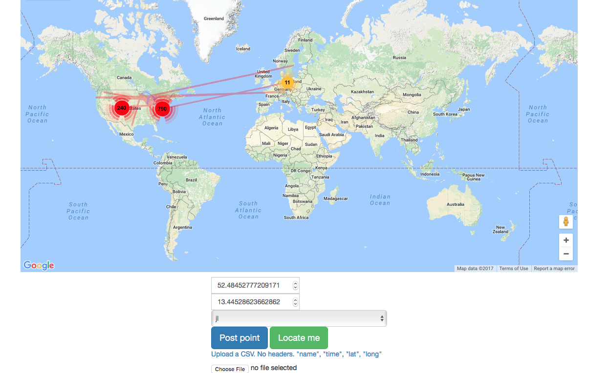

# catTracks

Tracking Cats and generating data

//TODO

- LAT/LONG :heavy_check_mark: db
- ELEVATION :heavy_check_mark: db
- SPEED :heavy_check_mark: db
- compass heading :heavy_check_mark: db
- TILT
- NUmber of cats
- cat heartrate :heavy_check_mark: db
- plots, mapper :heavy_check_mark:
- pics, first person and third person, upload if not black and with wifi and lots of battery

- First generator on computer desktop, then IOS.

//TODO , need to grap GAE datastore, or maybe just forgetaboutit

### plays well with [https://github.com/rotblauer/bildungs-roamin](https://github.com/rotblauer/bildungs-roamin)

### Starting development server

:beer:
```
go run main.go
```
### Frey bay bay


